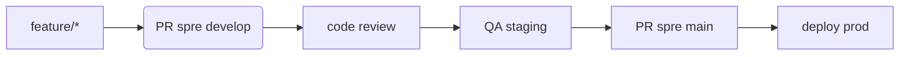

# Politică de Branching

## Flux

## Reguli
1. **Protectie branch**: `main` și `develop` necesită PR cu review
2. **Conventional Commits**: prefixe: `feat`, `fix`, `docs`, `style`, `refactor`, `test`, `chore`
3. **Semantic Versioning**: Folosiți `package.json` versioning

## Integrare Continuă
1. Rulați teste pe fiecare push
2. Build Docker la fiecare merge în `develop`
3. Scanare securitate săptămânală
